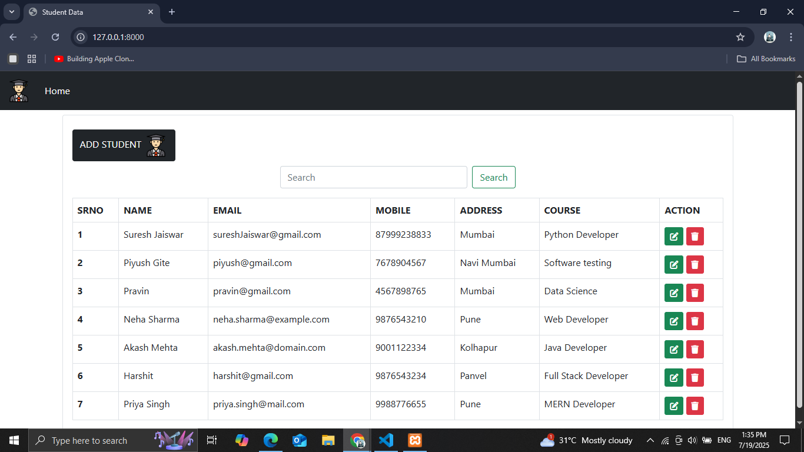
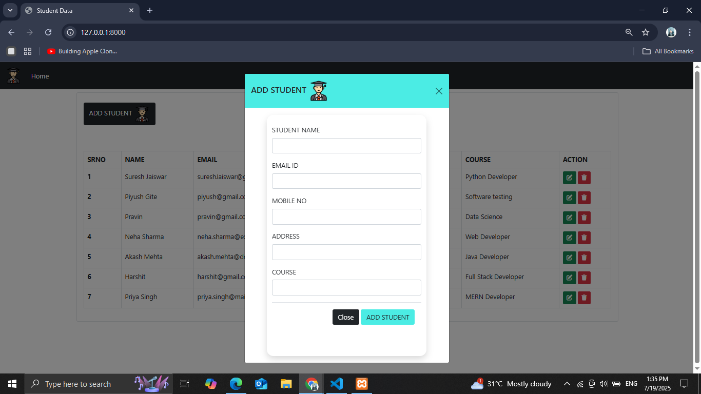
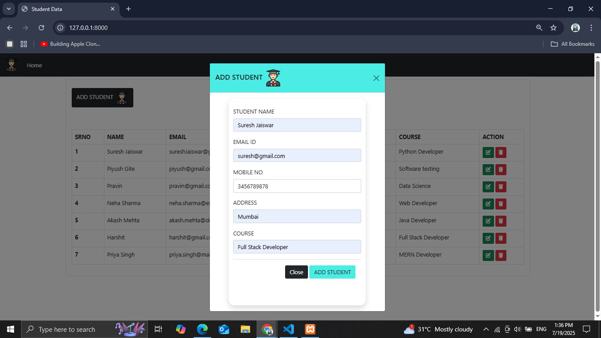
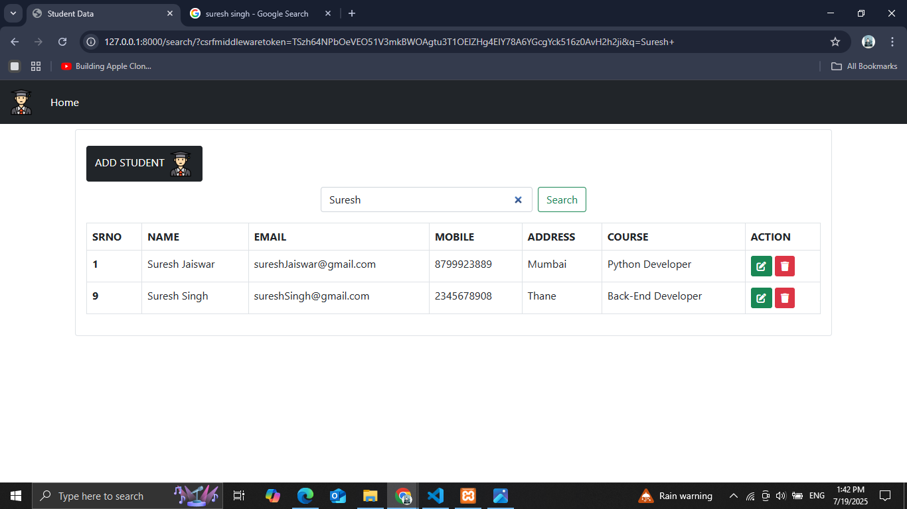
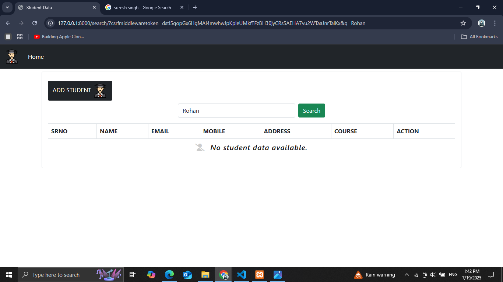
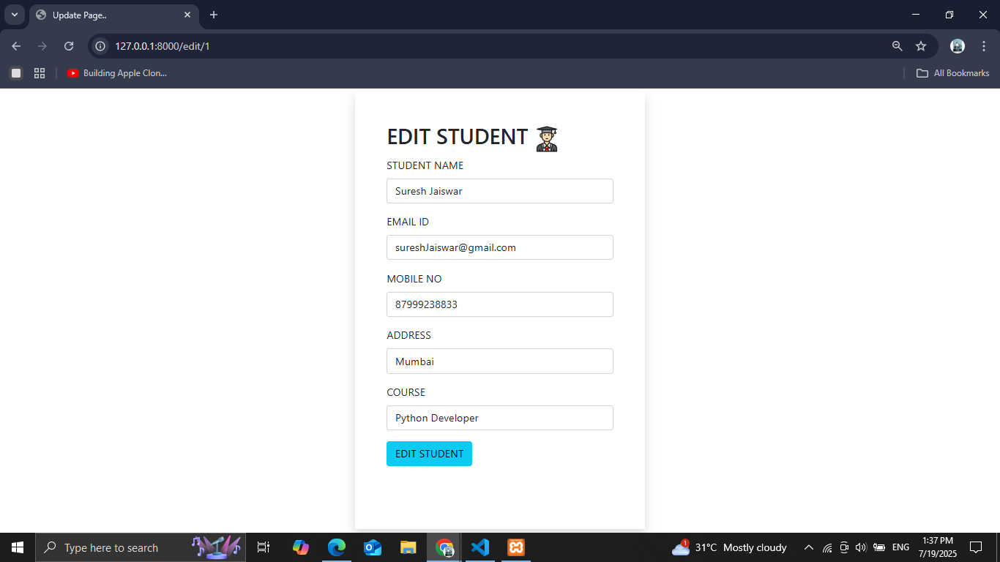
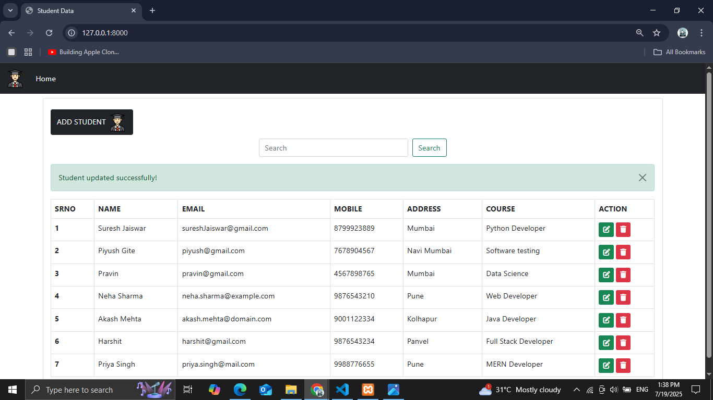
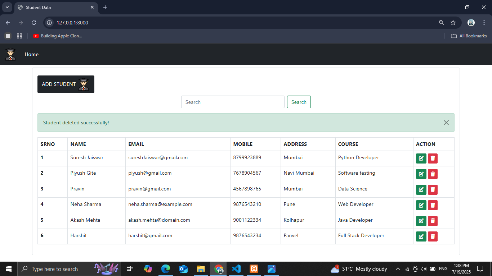
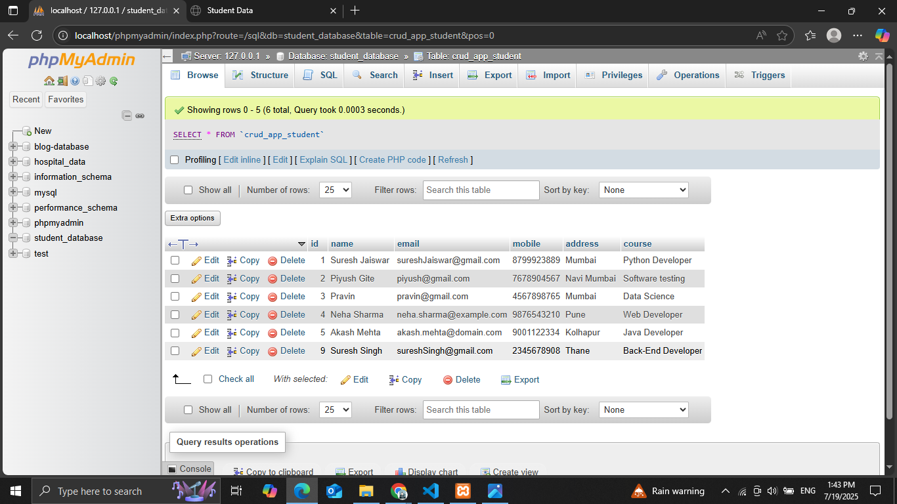

# 🎓 Student Management System - Django Project

This is a **Student Management System** built with **Django**, **HTML**, **CSS**, and **Bootstrap**.  
It allows users to add, update, delete, and search student records efficiently in a responsive web interface.

---

## ✅ Features

- 🔍 Search Student by Name , Address, etc.
- ➕ Add New Student with modal form
- ✏️ Edit Student Details
- 🗑️ Delete Student with confirmation
- 📋 Display all students in a table
- 📍 Filter Students by Name , Address (e.g. Mumbai) 
- 🎨 Clean Bootstrap UI with responsive design

---

## 🖥️ Tech Stack

| Technology | Usage |
|------------|--------|
| Python     | Core backend logic |
| Django     | Web framework |
| HTML5      | Markup language |
| CSS3       | Styling |
| Bootstrap  | Responsive UI design |
| SQLite     | Default database (can be switched to MySQL/PostgreSQL) |

---

## 📸 Screenshots

### 🔽 Home Page with Student List

### ➕ Add Student Modal

### 🔍 Search Functionality

### ✏️ Edit Student

### ✅ Updated Successfully

### 🗑️ Student Deleted Successfully

### 🗃️ Database Table (student data)

---

